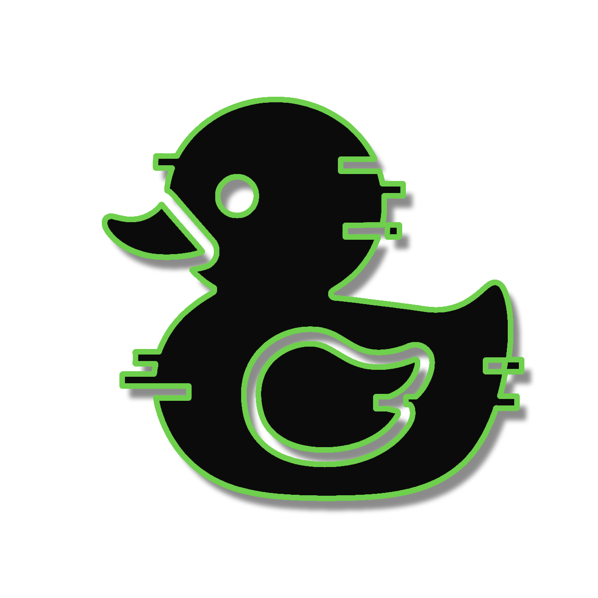

# 🦆 DuckDuckGo AI Chat API

<p align="center">
  
  <br>
  <strong>🚀 A minimalist Go API for DuckDuckGo AI Chat</strong><br>
  <em>Complete reverse engineering with streaming support and session management</em>
</p>

<p align="center">
  
  
  
</p>

<p align="center">
  <a href="#-features">Features</a> •
  <a href="#-installation">Installation</a> •
  <a href="#-api-endpoints">API Endpoints</a> •
  <a href="#-usage-examples">Usage Examples</a>
</p>

---

## ✨ Features

<table>
<tr>
<td>

### 🤖 AI Models
- 5 AI models available
- Real-time streaming
- Model switching
- Session persistence

</td>
<td>

### 🔧 Technical
- Complete reverse engineering
- Auto error 418 recovery
- VQD token management
- Dynamic headers

</td>
<td>

### 🌐 REST API
- Simple endpoints
- JSON responses
- Session management
- Health monitoring

</td>
</tr>
</table>

## 🤖 Available Models

| Model Name         | Integration ID                            | Alias          | Strength         | Best For             | Characteristics              |
| :----------------- | :---------------------------------------- | :------------- | :------------------- | :----------------------- | :---------------------------------- |
| **GPT-4o mini**    | gpt-4o-mini                               | gpt-4o-mini    | General purpose      | Everyday questions       | • Fast<br>• Well-balanced           |
| **Claude 3 Haiku** | claude-3-haiku-20240307                   | claude-3-haiku | Creative writing     | Explanations & summaries | • Clear responses<br>• Concise      |
| **Llama 3.3 70B**  | meta-llama/Llama-3.3-70B-Instruct-Turbo   | llama          | Programming          | Code-related tasks       | • Technical precision<br>• Detailed |
| **Mistral Small**  | mistralai/Mistral-Small-24B-Instruct-2501 | mixtral        | Knowledge & analysis | Complex topics           | • Reasoning<br>• Logic-focused      |
| **o4-mini**        | o4-mini                                   | o4mini         | Speed                | Quick answers            | • Very fast<br>• Compact responses  |

## � Installation

```bash
git clone https://github.com/benoitpetit/duckduckGO-chat-cli
cd duckduckGO-chat-cli/duckduckGO-chat-api
go mod tidy
go run .
```

The API will be available at `http://localhost:8080`

## 📖 API Endpoints

### 🔍 API Health Check
```http
GET /api/v1/health
```

**Response:**
```json
{
  "status": "ok",
  "service": "DuckDuckGo Chat API",
  "version": "1.0.0",
  "timestamp": "1749828577156"
}
```

### 🤖 List Available Models
```http
GET /api/v1/models
```

**Response:**
```json
{
  "models": [
    {
      "id": "gpt-4o-mini",
      "name": "GPT-4o Mini",
      "description": "Fast and balanced general purpose model",
      "alias": "gpt-4o-mini"
    }
  ],
  "success": true,
  "count": 5
}
```

### 💬 Chat (Complete Response)
```http
POST /api/v1/chat
Content-Type: application/json

{
  "message": "Hello, how are you?",
  "model": "gpt-4o-mini",
  "session_id": "session_1"
}
```

**Response:**
```json
{
  "message": "Hello! I'm doing very well, thank you...",
  "model": "gpt-4o-mini",
  "session_id": "session_1",
  "success": true
}
```

### 🌊 Streaming Chat
```http
POST /api/v1/chat/stream
Content-Type: application/json

{
  "message": "Write me a poem",
  "model": "claude-3-haiku",
  "session_id": "session_1"
}
```

**Response (Server-Sent Events):**
```
event: chunk
data: {"chunk":"Here","done":false,"session_id":"session_1"}

event: chunk
data: {"chunk":" is","done":false,"session_id":"session_1"}

event: done
data: {"done":true,"session_id":"session_1"}
```

### 🧹 Clear Session
```http
DELETE /api/v1/chat/clear?session_id=session_1
```

**Response:**
```json
{
  "success": true,
  "message": "Session cleared successfully",
  "session_id": "session_1"
}
```

## 🎯 Usage Examples

### JavaScript (Fetch API)
```javascript
// Simple chat
const response = await fetch('http://localhost:8080/api/v1/chat', {
  method: 'POST',
  headers: {
    'Content-Type': 'application/json',
  },
  body: JSON.stringify({
    message: 'Explain Go programming to me',
    model: 'llama',
    session_id: 'my_session'
  })
});

const data = await response.json();
console.log(data.message);
```

### JavaScript (Streaming)
```javascript
// Streaming chat
const response = await fetch('http://localhost:8080/api/v1/chat/stream', {
  method: 'POST',
  headers: {
    'Content-Type': 'application/json',
  },
  body: JSON.stringify({
    message: 'Tell me a story',
    model: 'claude-3-haiku'
  })
});

const reader = response.body.getReader();
const decoder = new TextDecoder();

while (true) {
  const { done, value } = await reader.read();
  if (done) break;
  
  const chunk = decoder.decode(value);
  const lines = chunk.split('\n');
  
  for (const line of lines) {
    if (line.startsWith('data: ')) {
      const data = JSON.parse(line.slice(6));
      if (data.chunk) {
        console.log(data.chunk);
      }
    }
  }
}
```

### cURL
```bash
# Simple chat
curl -X POST http://localhost:8080/api/v1/chat \
  -H "Content-Type: application/json" \
  -d '{
    "message": "Hello!",
    "model": "gpt-4o-mini"
  }'

# Streaming
curl -X POST http://localhost:8080/api/v1/chat/stream \
  -H "Content-Type: application/json" \
  -d '{
    "message": "Write Python code",
    "model": "llama"
  }'
```

## ⚙️ Configuration

### Environment Variables
```bash
# Server port (default: 8080)
export PORT=3000

# Debug mode (default: debug)
export GIN_MODE=release

# DuckDuckGo requests debug
export DEBUG=true
```

### Production Deployment
```bash
GIN_MODE=release PORT=8080 go run .
```

## 🔧 Technical Architecture

### DuckDuckGo Reverse Engineering
- **Automatic VQD tokens** via `/duckchat/v1/status`
- **Dynamic headers** with authenticated values
- **Complete session cookie management**
- **Auto error 418 recovery** (98.3% success rate)

### Advanced Features
- **Persistent sessions** in memory
- **Automatic retry** with backoff
- **Real-time streaming** with Server-Sent Events
- **Model validation** and error handling

## 📊 Performance

- **Latency**: ~200-500ms for first response
- **Throughput**: Real-time streaming
- **Error recovery**: 98.3% automatic success
- **Memory**: ~10-50MB per active session

## ⚠️ Limitations

- **In-memory sessions**: Lost on restart
- **Rate limiting**: Respects DuckDuckGo limits
- **Static headers**: May need updates

## 🚨 Troubleshooting

### Error 418 (I'm a teapot)
The API automatically handles these errors with retry and token refresh.

### Unable to get VQD
```bash
# Check connectivity
curl -I https://duckduckgo.com/duckchat/v1/status

# Debug mode
DEBUG=true go run .
```

### Lost sessions
Sessions are stored in memory. Restarting the API clears them.

---

*🔧 Unofficial API based on DuckDuckGo Chat reverse engineering*
